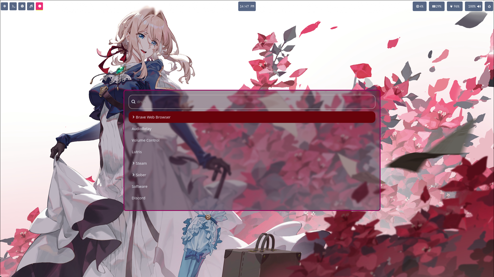

<h1 align="center">✨ HYPERLAN ✨</h1>
<p align="center">
  <b>Setup dari 2 King 👑</b><br>
  Minimalist • Fast • Beautiful • Hyprland-based
</p>

<p align="center">
  
  
  
</p>

---

## 🌀 Deskripsi

**Hyperlan** adalah setup pribadi berbasis **Hyprland**, dikombinasikan dengan **Waybar**, **Wofi**, dan beberapa konfigurasi tambahan lainnya untuk menciptakan tampilan *clean*, *modern*, dan *performant*.

> Fokus pada kesederhanaan, keindahan, dan efisiensi 💨

---

## 🌟 Fitur Utama

✅ **Hyprland** — window manager super cepat dan fleksibel  
✅ **Waybar** — status bar elegan dengan informasi real-time  
✅ **Wofi** — launcher yang ringan dan dapat disesuaikan  
✅ **Konfigurasi modular** — mudah dimodifikasi dan dikembangkan  
✅ **Estetika rapi** — warna, font, dan layout sudah disesuaikan  

---

## 🧩 Struktur Direktori

```bash
hyperlan/
├── hypr/          # Konfigurasi utama untuk Hyprland
├── waybar/        # Pengaturan untuk Waybar (status bar)
└── wofi/          # Konfigurasi untuk Wofi (app launcher)
```


⚙️ Instalasi
1️⃣ Clone Repository
```bash
Copy code
git clone https://github.com/dudi2009/hyperlan.git
cd hyperlan
```
2️⃣ Pindahkan Konfigurasi ke ~/.config
```bash
Copy code
cp -r hypr ~/.config/hypr
cp -r waybar ~/.config/waybar
cp -r wofi ~/.config/wofi
```
3️⃣ Pastikan Dependensi Terinstal
Komponen	Deskripsi	Instalasi (contoh Arch)
🪟 Hyprland	Window manager utama	sudo pacman -S hyprland
📊 Waybar	Status bar	sudo pacman -S waybar
🚀 Wofi	App launcher	sudo zpacman -S wofi
💅 Themes & Icons	Tampilan tambahan	sudo pacman -S papirus-icon-theme nwg-look

4️⃣ Jalankan!
Logout, lalu pilih sesi Hyprland di login manager Anda.
Nikmati desktop baru Anda 🎨

🧠 Kustomisasi
Edit file konfigurasi sesuai selera Anda:

```bash
Copy code
~/.config/hypr/hyprland.conf     # Shortcut, layout, animasi
~/.config/waybar/config.jsonc    # Modul, tampilan bar
~/.config/wofi/config            # Gaya launcher
```

Tambahkan warna, font, atau tema Anda sendiri.
Kreativitas tidak ada batasnya! 💡

🖼️ Screenshot 



🧑‍💻 Kontribusi
🎯 Pull request selalu diterima!
Jika kamu punya ide, perbaikan bug, atau tema baru — langsung saja buka Issue atau PR.

Fork repo ini

Buat branch baru

Commit perubahanmu

Kirim PR 🎉

📜 Lisensi
Lisensi: MIT License
Silakan gunakan, modifikasi, dan bagikan kembali setup ini sesuai kebutuhanmu.

💬 Kontak
📦 Repo: github.com/dudi2009/hyperlan
👤 Author: @dudi2009
📧 Email: (dudicoklat@gmail.com)
